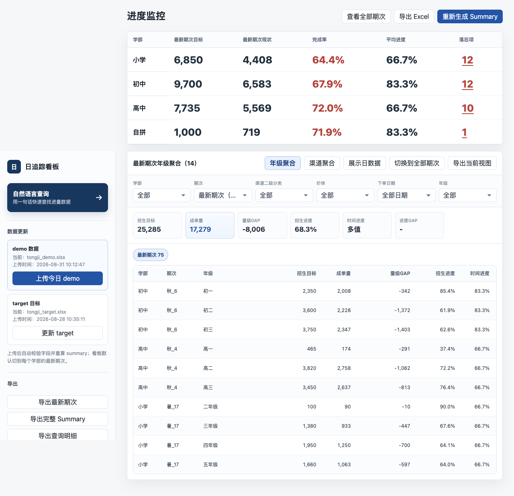

# 日追踪看板

读取每日 `tongji_demo.xlsx` 和每周 `tongji_target.xlsx`，生成进度汇总、网页看板、学部播报图，并支持钉钉群播报和规则化自然语言查询。



产品需求、计算口径和钉钉播报链路以 [PRD](./docs/PRD-progress-dashboard.md) 为准，历史变更见 [CHANGELOG](./docs/CHANGELOG.md)。

## 目录

```
app.py               本地 HTTP 服务和 API
web/                 看板前端
outputs/             Summary 计算、工作簿和中间结果
reports/             播报图生成与导出
config/              渠道别名和本地服务配置
tests/               自动化测试
docs/                PRD 和变更记录
decisions/           架构决策
source/              原始需求证据
rules/               项目规则
archives/            历史压缩快照
```

## 常用操作

- 启动与重启：`scripts/restart_dashboard.sh`
- 发布只读看板：`python3 scripts/publish_netlify.py`
- 线上只读看板：`https://kityhello.dpdns.org/web/index.html`
- 健康检查：`GET /api/health`
- 页面入口：`http://127.0.0.1:8766`
- 修改产品行为前先核对 [PRD](./docs/PRD-progress-dashboard.md)。

## 线上实时同步

本地点击 `上传今日 demo` 或 `更新 target` 后，会先重算本地 Summary、工作簿和播报图，再把最新状态同步到线上只读看板。同步成功后，线上页面刷新即可看到最新数据；同步失败时，本地更新仍保留，页面会显示失败原因。

本地同步复用 `.env.local` 中的 `REPORT_UPLOAD_TOKEN`，也可以单独配置 `DASHBOARD_SYNC_TOKEN`。默认同步地址是 `https://kityhello.dpdns.org/api/state` 和 `https://kityhello.dpdns.org/download/workbook`。

## 钉钉播报

看板支持生成小学、初中、高中、自拼每日招生进度播报图，以及 `lec1元占比` 播报图。用户可以在本地看板下载图片，也可以通过钉钉机器人发送到群里。

播报图样例和字段口径见 [PRD 的 Daily broadcast images and DingTalk delivery 小节](./docs/PRD-progress-dashboard.md#daily-broadcast-images-and-dingtalk-delivery)。真实群播报需要配置 `DINGTALK_WEBHOOK`；如果钉钉客户端需要访问公网图片地址，还需要配置 `DINGTALK_REPORT_BASE_URL`，或配合 `REPORT_IMAGE_UPLOAD_URL` 和 `REPORT_UPLOAD_TOKEN` 上传图片。
